# Buscar productos del catálogo — GET /catalog/productos/buscar

Diagrama de secuencia detallado de una llamada real al endpoint: `GET /api/v1/catalog/productos/buscar?q=1009647&pageSize=20`.
A diferencia de los diagramas `SEQ_CU-*` (que resumen el endpoint en 2-3 líneas dentro del flujo de un caso de uso más amplio), este archivo baja al detalle de implementación: los dos saltos de autenticación hacia CATI, el cache en memoria, el fan-out a 3 llamadas paralelas y los distintos puntos de falla. Contrato funcional: [`Arquitectura/Contratos/08_catalogo/GET_productos_buscar.md`](Contratos/08_catalogo/GET_productos_buscar.md). Casos de uso: CU-04-01 (agregar producto a una posición) / CU-05-02 (elegir SKU sustituto) — ver `Arquitectura/ENDPOINTS.md` línea del endpoint y `Arquitectura/CASOS_DE_USO.md`.

Código recorrido: `back/src/infrastructure/http/routes/catalogo.routes.js` → `back/src/application/catalogo/catalogo.controller.js` → `back/src/infrastructure/cati/catiClient.js` (+ `tokenManager.js` / `caoClient.js` para la autenticación hacia CATI) → `back/src/infrastructure/http/middlewares/errorHandler.js` en los casos de error.

```mermaid
sequenceDiagram
    actor Analista
    participant FE as Frontend (React)
    participant API as Backend (Express)
    participant CACHE as Cache en memoria (proceso Node)
    participant CAO as CAO - CemacoAllInOne (externo)
    participant CATI as CATI - API.Catalogo (externo)

    %% ─── ACTORES Y CANALES ─────────────────────────────────────────────────────
    %% Analista        → usuario final (rol Analista), opera el buscador de productos
    %%                   del Editor de planogramas.
    %% Frontend        → SPA React; único canal que el Analista toca directamente.
    %% Backend Express → catalogo.routes.js → catalogo.controller.js → catiClient.js.
    %%                   El módulo "catalog" NO tiene capa de dominio propia: es un
    %%                   proxy/caché de solo lectura hacia CATI (ver cabecera de
    %%                   catalogo.controller.js). Los errores de negocio (Joi, CATI
    %%                   caído) llegan por next(err) al errorHandler global, que arma
    %%                   { error: { code, message, details? } } (ver errorHandler.js).
    %% Cache           → Map en memoria dentro del mismo proceso Node (no Redis). No
    %%                   se comparte entre instancias si el backend escala horizontal,
    %%                   ni sobrevive un redeploy/reinicio. TTL de 5 min para búsquedas
    %%                   (distinto del TTL de 30 min que usa este mismo cliente para
    %%                   jerarquía — ver catiClient.js).
    %% CAO             → servicio externo "Cemaco All In One", primer salto de
    %%                   autenticación: POST https://cemacoallinone.azurewebsites.net/api/auth
    %%                   con credenciales de servicio (CAO_USER/CAO_PASSWORD en .env).
    %% CATI            → servicio externo de catálogo (SAP/VTEX detrás), alcanzable
    %%                   solo por VPN/red interna Cemaco (10.20.12.9). Segundo salto de
    %%                   auth vía POST /api/Auth/exchange, luego GET /api/Product/search.
    %%                   Todas las llamadas a CATI envían Authorization: Bearer
    %%                   {accessToken} + x-api-key: {CATI_API_KEY}.
    %% ─────────────────────────────────────────────────────────────────────────────

    Analista->>FE: Escribe "1009647" en el buscador de productos
    FE->>API: GET /api/v1/catalog/productos/buscar<br/>?q=1009647&pageSize=20

    API->>API: Router (catalogo.routes.js): "/productos/buscar" matchea<br/>antes que "/productos/:sku" → catalogo.controller.buscarProductos<br/>Valida query con Joi (schemaBuscar):<br/>q="1009647" (≥2 chars) ✓ · page=1 (default) · pageSize=20<br/>or(q, subcategoria) satisfecho por q

    alt Validación Joi falla (ej. q de 1 char y sin subcategoria)
        API-->>FE: 400 Bad Request<br/>{ error: { code: VALIDATION_ERROR,<br/>message: "Datos de entrada inválidos", details[] } }
        FE-->>Analista: Muestra error de validación
    else Validación OK
        API->>API: catiClient.buscarProductos(<br/>{ q:"1009647", subcategoria:undefined, page:1, pageSize:20 })
        API->>CACHE: get("catalogo:buscar:{q:1009647,subcategoria:undefined,<br/>page:1,pageSize:20}")

        alt Cache HIT (misma búsqueda exacta en los últimos 5 min)
            CACHE-->>API: productos[] cacheados
        else Cache MISS
            Note over API,CATI: CATI combina los filtros de /Product/search con AND, no OR:<br/>mandar Sku=Descripcion=Marca=q a la vez casi nunca matchea.<br/>Se hace 1 llamada por campo, en paralelo, y se combinan<br/>sin duplicar (por sku) — ver comentario en catiClient.js

            rect rgba(89, 89, 89, 1)
                Note over API,CATI: Autenticación hacia CATI (tokenManager) —<br/>se evalúa antes de cada llamada HTTP a CATI
                alt Token cacheado y vigente (margen de 60s antes de expirar)
                    Note over API: Reusa accessToken en memoria, sin red
                else Token ausente o vencido
                    API->>CAO: POST /api/auth<br/>{ user: CAO_USER, password: CAO_PASSWORD }
                    CAO-->>API: { data: { token: tokenCAO } }
                    API->>CATI: POST /api/Auth/exchange<br/>{ tokenCemacoAllInOne: tokenCAO }  [x-api-key]
                    CATI-->>API: { data: { accessToken, ... } } (o { accessToken } plano)
                    API->>API: Decodifica exp del JWT (base64url)<br/>Cachea accessToken hasta exp − 60s<br/>(fallback 10 min si el JWT no trae exp)
                end

                opt CAO no responde, o CATI rechaza/no responde el exchange
                    API-->>FE: 503 Service Unavailable<br/>{ error: { code: SERVICE_UNAVAILABLE,<br/>message: "No se pudo conectar con CAO/CATI" } }
                    FE-->>Analista: Muestra "catálogo no disponible, intenta de nuevo"
                end

                Note over API: Sin coalescing: si el token no estaba cacheado, cada una<br/>de las 3 llamadas de abajo dispara su propio intercambio<br/>CAO→CATI en paralelo (caso frío, poco frecuente porque<br/>el token dura minutos/horas — ver tokenManager.js)
            end

            par Busca por SKU
                API->>CATI: GET /api/Product/search?Sku=1009647&Profile=CEMACO<br/>&PageNumber=1&PageSize=20  [Bearer, x-api-key] · timeout 5000ms
                CATI-->>API: 200 { items: [ { sku, descripcion, marca,<br/>desSubcategoria, modelo, internalAttributes }, ... ] }
            and Busca por Descripción
                API->>CATI: GET /api/Product/search?Descripcion=1009647&Profile=CEMACO<br/>&PageNumber=1&PageSize=20  [Bearer, x-api-key] · timeout 5000ms
                CATI-->>API: 200 { items: [...] }
            and Busca por Marca
                API->>CATI: GET /api/Product/search?Marca=1009647&Profile=CEMACO<br/>&PageNumber=1&PageSize=20  [Bearer, x-api-key] · timeout 5000ms
                CATI-->>API: 200 { items: [...] }
            end

            opt Alguna de las 3 llamadas falla, o CATI no responde en 5s
                Note over API,CATI: Promise.all rechaza completo ante el primer error<br/>(AbortController corta la llamada lenta al cumplirse el timeout)
                API-->>FE: 503 Service Unavailable<br/>{ error: { code: SERVICE_UNAVAILABLE,<br/>message: "CATI respondió con status ... en /Product/search"<br/>o "No se pudo conectar con CATI" } }
                FE-->>Analista: Muestra "catálogo no disponible, intenta de nuevo"
            end

            API->>API: Combina los 3 resultados sin duplicar (Set por sku)<br/>Filtra estaActivo(internalAttributes) — excluye inactivos<br/>Mapea a { sku, nombre, marca, subcategoria, modelo,<br/>ancho_cm:null, alto_cm:null, profundidad_cm:null,<br/>imagen_url:null, precio:null }<br/>(dimensiones/imagen/precio solo vienen en el detalle de un<br/>SKU puntual, no en /Product/search — ver mapProductoBusqueda)<br/>Recorta el combinado a pageSize (20)
            API->>CACHE: set(clave, productos[], ttl=5 min)
        end

        API-->>FE: 200 OK<br/>[ { sku, nombre, marca, subcategoria, modelo,<br/>ancho_cm:null, alto_cm:null, profundidad_cm:null,<br/>imagen_url:null, precio:null }, ... ]
        FE-->>Analista: Renderiza resultados en el buscador<br/>(para agregar a una posición o elegir SKU sustituto)
    end
```

## Notas — comportamiento no obvio desde el contrato

- **Cache in-memory, no distribuida.** `CACHE_TTL_BUSQUEDA_MS = 5 * 60 * 1000` vive en un `Map` dentro
  del proceso Node (`catiClient.js`). Si el backend corre en más de una instancia, cada una tiene su
  propio cache — un `pageSize`/`page`/`q` distinto ya es una clave distinta, así que la tasa de
  aciertos es baja salvo búsquedas repetidas idénticas.
- **Fan-out por AND vs OR.** CATI no soporta "Sku OR Descripcion OR Marca" en una sola llamada — cada
  parámetro que se envía se combina con AND. Por eso `q="1009647"` dispara 3 llamadas HTTP paralelas
  a CATI, no 1, y el backend deduplica por `sku` del lado de Node.
- **Sin coalescing de tokens.** `tokenManager.obtenerAccessToken()` no memoiza la promesa en vuelo: si
  el token no está cacheado, las 3 llamadas paralelas de arriba pueden disparar 3 intercambios
  CAO→CATI concurrentes en el peor caso (poco frecuente, porque el JWT suele durar bastante más que
  el intervalo entre búsquedas).
- **Campos siempre `null` en este endpoint.** `ancho_cm`, `alto_cm`, `profundidad_cm`, `imagen_url` y
  `precio` vienen `null` en la búsqueda porque `/Product/search` de CATI no los expone — solo están
  disponibles pidiendo `GET /catalog/productos/{sku}` (detalle) para un SKU puntual. El frontend debe
  pedir el detalle antes de mostrar esos datos.
